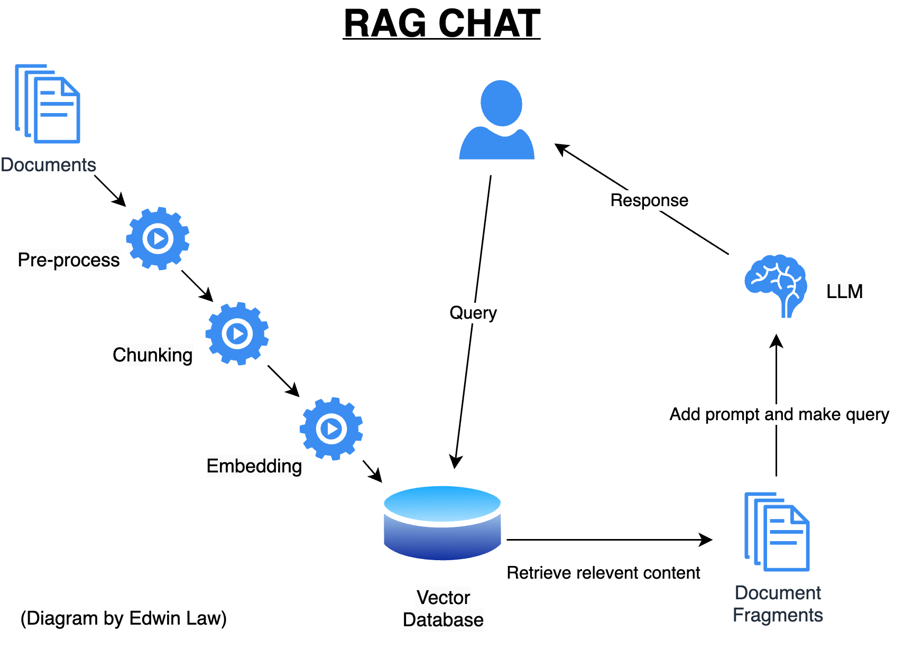

# RAG-Chat
This is a simple configurable GTP-style chatbot built on the Retrieval-Augmented Generation (RAG) architecture. I built it with highly configurable and extensible modules in mind.

## Architecture


## Instructions
1. Clone GIT respository
2. Initiate Python environment
    ```
    python3 -m venv .
    ```
3. Install required python libraries
    ```
    bin/pip install -r requirements.txt
    ```
4. Modify configuration file `config.py`
    - See **Configuration Settings** section.

5. Setup OpenAI key (if you want to use OpenAI APIs)
    ```
    export OPENAI_API_KEY=<OpenAI Key>
    ```
    _where <OpenAI Key> is your OpenAI access key_

6. Start Ollama locally (if you want to use local LLMs)

7. Create vector database from documents
    ```
    bin/python3 create_database.py 
    ```
8. Run app
    ```
    bin/python3 ragchat.py 
    ```

### Configuration Settings
- `DOC_DIRECTORY` - Path of the directory containing your custom documents.
    - Example:
        ```
        PRELOAD_DIRECTORY = 'data/doc'
        ```
- `VECTORDB_DIRECTORY` - Path of your vectordb directory.
    - Example:
        ```
        VECTORDB_DIRECTORY = 'data/vectordb/chroma/'
        ```
- `EMBEDDING_MODEL` - Embedding model
    - Current code accepts embedding models from OpenAI and Hugging Face.
    - Example:
        ```
        EMBEDDING_MODEL = 'avsolatorio/GIST-Embedding-v0'
        ```
- `CREATE_NEW_VECTORDB` - Create new database or build on existing one.
    - Set to `True` if you want to create a new vectordb from scratch.
    - Set to `False` if you want to build on an existing vectordb.
    - Example:
        ```
        CREATE_NEW_VECTORDB = True
        ```
- `CHUNK_SIZE` - Chunk size for chunking operation.
    - Example:
        ```
        CHUNK_SIZE = 1500
        ```
- `CHUNK_OVERLAP` - Chunk overlap for chunking operation.
    - Example:
        ```
        CHUNK_OVERLAP = 500
        ```
- `LLM_LIST` - List of available LLMs
    - This list is displayed in runtime for the user.
    - Current code accepts LLMs from OpenAI and Hugging Face.
    - Not every LLM on the list has to be available, as long as the user does not choose the unavailable ones.
    - Example:
        ```
        LLM_LIST = ["gpt-3.5-turbo", "mistral:instruct", "llama2:latest", "tinyllama"]
        ```
- `DEFAULT_LLM` - Default LLM 
    - Default LLM selected in runtime.
    - Example:
        ```
        DEFAULT_LLM = "mistral:instruct"
        ```
- `LLM_PROMPT` - Prompt header passed to the LLM
    - Example:
        ```
        Here is some information including a chat history, some retrieved   content and the source. 
        Your task is to respond to the user's new question using the    information from the retrieved content.
        If no relevant information is found in the retreived content, say   so. Do not use your own information.

        You will receive a prompt with the the following format:

        # Chat history:
        [user query, response]

        # Retrieved content number:
        Content
        Source

        # User new question:
        New question
        ```
- `K` - Number of documents returned from the vectordb similarity search
    - Example:
        ```
        K = 3
        ```
- `NUMBER_QA_PAIRS` - Number of Q/A pairs preserved in chat history
    - Example:
        ```
        NUMBER_QA_PAIRS = 2
        ```

## Configurable/Extensible Components
### Document Pre-processing
Documents are loaded as is. The current code also added logic to add the date of the document if it can be inferred from the filename.

Additional pre-processing can be added to the code in the future.

### Chunking Strategy
The current code uses the basic chunking method by splitting the documents into chunks of equal size (determined by the `CHUNK_SIZE` parameter), with overlaps (determined by the `CHUNK_OVERLAP` parameter)

Alternative chunking strategies can be explored by swapping out the chunking method in the code.

### Embedding Model
Embedding model is specified in the configuration file. The same model must be used to create the vector database and to read from it.

### Vector Database
The current code uses Chroma which is a local vector database. Alternative vector databases can by explored by swapping out the vector database class and its methods in the code.

### LLM
A list of available LLMs is specified in the configuration file. The actual LLM to be used can be selected in runtime.

# Acknowledge
My inpsiration originally came from this other project by Farzad-R:
[LLM-Zero-to-Hundred/RAG-GPT](https://github.com/Farzad-R/LLM-Zero-to-Hundred/tree/master/RAG-GPT)
